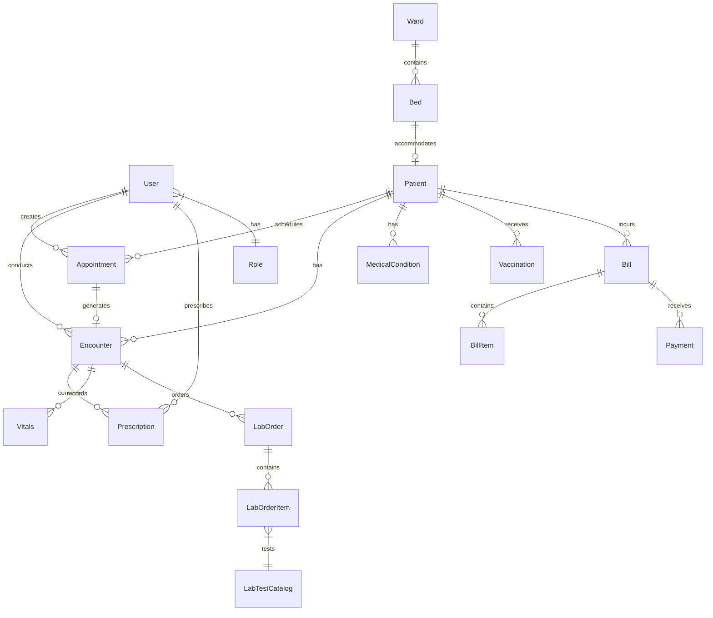

# Database Schema Documentation

This document describes the database schema for the Chelal Hospital Management System.

## Overview

The system uses PostgreSQL as the primary database and follows Django ORM conventions. All models are defined in `core/models.py`.

## Core Models

### User Management

#### User
Custom user model extending Django's AbstractUser.

```python
class User(AbstractUser):
    role = models.ForeignKey(Role, on_delete=models.SET_NULL, null=True, blank=True)
    phone_number = models.CharField(max_length=15, blank=True)
    profile_image = models.ImageField(upload_to='profile_images/', blank=True, null=True)
    is_active_session = models.BooleanField(default=False)
    last_activity = models.DateTimeField(auto_now=True)
```

**Fields:**
- `username` - Unique username
- `email` - User email address
- `first_name`, `last_name` - User's full name
- `role` - Foreign key to Role model
- `phone_number` - Contact number
- `profile_image` - User's profile picture
- `is_active_session` - Session status tracking
- `last_activity` - Last activity timestamp

**Relationships:**
- One-to-many with Role
- One-to-many with AuditLog
- One-to-many with Notification
- One-to-many with Task

#### Role
Defines user roles and permissions.

```python
class Role(models.Model):
    name = models.CharField(max_length=50, unique=True)
    description = models.TextField(blank=True)
    permissions = models.JSONField(default=dict)
```

**Standard Roles:**
- `Admin` - Full system access
- `Doctor` - Medical records, prescriptions, appointments
- `Nurse` - Patient care, vitals, basic records
- `Receptionist` - Appointments, patient registration
- `Pharmacist` - Pharmacy operations, dispensing
- `Lab Technician` - Lab orders and results

### Patient Management

#### Patient
Core patient information and demographics.

```python
class Patient(models.Model):
    patient_id = models.CharField(max_length=20, unique=True)
    first_name = models.CharField(max_length=100)
    last_name = models.CharField(max_length=100)
    date_of_birth = models.DateField()
    gender = models.CharField(max_length=10, choices=GENDER_CHOICES)
    phone_number = models.CharField(max_length=15)
    email = models.EmailField(blank=True)
    address = models.TextField()
    emergency_contact_name = models.CharField(max_length=200)
    emergency_contact_phone = models.CharField(max_length=15)
    insurance = models.ForeignKey(InsuranceDetail, null=True, blank=True)
```

**Relationships:**
- One-to-many with Appointment
- One-to-many with Encounter
- One-to-many with MedicalCondition
- One-to-many with Vaccination
- One-to-many with PatientDocument

### Clinical Operations

#### Appointment
Manages patient appointments with healthcare providers.

```python
class Appointment(models.Model):
    patient = models.ForeignKey(Patient, on_delete=models.CASCADE)
    doctor = models.ForeignKey(User, on_delete=models.CASCADE)
    appointment_date = models.DateTimeField()
    status = models.CharField(max_length=20, choices=STATUS_CHOICES)
    appointment_type = models.CharField(max_length=50)
    notes = models.TextField(blank=True)
    created_by = models.ForeignKey(User, related_name='created_appointments')
```

**Status Choices:**
- `scheduled` - Appointment confirmed
- `completed` - Appointment finished
- `cancelled` - Appointment cancelled
- `no_show` - Patient didn't attend

#### Encounter
Clinical encounters and medical records.

```python
class Encounter(models.Model):
    patient = models.ForeignKey(Patient, on_delete=models.CASCADE)
    doctor = models.ForeignKey(User, on_delete=models.CASCADE)
    appointment = models.ForeignKey(Appointment, null=True, blank=True)
    encounter_date = models.DateTimeField(auto_now_add=True)
    chief_complaint = models.TextField()
    history_of_present_illness = models.TextField()
    physical_examination = models.TextField()
    assessment = models.TextField()
    plan = models.TextField()
    diagnosis = models.TextField()
```

**Relationships:**
- One-to-many with Prescription
- One-to-many with Vitals
- One-to-many with LabOrder

#### Prescription
Medication prescriptions linked to encounters.

```python
class Prescription(models.Model):
    encounter = models.ForeignKey(Encounter, on_delete=models.CASCADE)
    medication_name = models.CharField(max_length=200)
    dosage = models.CharField(max_length=100)
    frequency = models.CharField(max_length=100)
    duration = models.CharField(max_length=100)
    instructions = models.TextField(blank=True)
    prescribed_by = models.ForeignKey(User, on_delete=models.CASCADE)
```

### Pharmacy Management

#### MedicationItem
Pharmacy medication master data.

```python
class MedicationItem(models.Model):
    name = models.CharField(max_length=200)
    generic_name = models.CharField(max_length=200)
    category = models.ForeignKey(MedicationCategory, on_delete=models.CASCADE)
    strength = models.CharField(max_length=50)
    unit = models.CharField(max_length=20)
    manufacturer = models.CharField(max_length=200)
    rxnorm_code = models.CharField(max_length=50, blank=True)
    is_active = models.BooleanField(default=True)
```

#### StockBatch
Pharmacy inventory tracking with batch management.

```python
class StockBatch(models.Model):
    medication = models.ForeignKey(MedicationItem, on_delete=models.CASCADE)
    batch_number = models.CharField(max_length=100)
    expiry_date = models.DateField()
    quantity_received = models.PositiveIntegerField()
    quantity_remaining = models.PositiveIntegerField()
    cost_price = models.DecimalField(max_digits=10, decimal_places=2)
    selling_price = models.DecimalField(max_digits=10, decimal_places=2)
    supplier = models.ForeignKey(Supplier, on_delete=models.CASCADE)
```

### Laboratory Management

#### LabOrder
Laboratory test orders and results.

```python
class LabOrder(models.Model):
    patient = models.ForeignKey(Patient, on_delete=models.CASCADE)
    encounter = models.ForeignKey(Encounter, null=True, blank=True)
    ordered_by = models.ForeignKey(User, on_delete=models.CASCADE)
    order_date = models.DateTimeField(auto_now_add=True)
    status = models.CharField(max_length=20, choices=STATUS_CHOICES)
    priority = models.CharField(max_length=20, choices=PRIORITY_CHOICES)
    clinical_notes = models.TextField(blank=True)
```

#### LabOrderItem
Individual test items within a lab order.

```python
class LabOrderItem(models.Model):
    lab_order = models.ForeignKey(LabOrder, on_delete=models.CASCADE)
    test_catalog = models.ForeignKey(LabTestCatalog, on_delete=models.CASCADE)
    status = models.CharField(max_length=20, choices=STATUS_CHOICES)
    collected_at = models.DateTimeField(null=True, blank=True)
    result_date = models.DateTimeField(null=True, blank=True)
    reviewed_by = models.ForeignKey(User, null=True, blank=True)
```

### Billing and Financial

#### Bill
Patient billing information.

```python
class Bill(models.Model):
    patient = models.ForeignKey(Patient, on_delete=models.CASCADE)
    bill_number = models.CharField(max_length=50, unique=True)
    bill_date = models.DateTimeField(auto_now_add=True)
    total_amount = models.DecimalField(max_digits=10, decimal_places=2)
    paid_amount = models.DecimalField(max_digits=10, decimal_places=2, default=0)
    is_paid = models.BooleanField(default=False)
    insurance = models.ForeignKey(InsuranceDetail, null=True, blank=True)
```

#### Payment
Payment records for bills.

```python
class Payment(models.Model):
    bill = models.ForeignKey(Bill, on_delete=models.CASCADE)
    amount = models.DecimalField(max_digits=10, decimal_places=2)
    payment_method = models.CharField(max_length=20, choices=PAYMENT_METHODS)
    payment_date = models.DateTimeField(auto_now_add=True)
    reference_number = models.CharField(max_length=100, blank=True)
    processed_by = models.ForeignKey(User, on_delete=models.CASCADE)
```

### Facility Management

#### Ward
Hospital ward information.

```python
class Ward(models.Model):
    name = models.CharField(max_length=100)
    description = models.TextField(blank=True)
    capacity = models.PositiveIntegerField()
    ward_type = models.CharField(max_length=50, choices=WARD_TYPE_CHOICES)
    is_active = models.BooleanField(default=True)
```

#### Bed
Individual bed tracking.

```python
class Bed(models.Model):
    ward = models.ForeignKey(Ward, on_delete=models.CASCADE)
    bed_number = models.CharField(max_length=10)
    bed_type = models.CharField(max_length=50, choices=BED_TYPE_CHOICES)
    is_occupied = models.BooleanField(default=False)
    current_patient = models.ForeignKey(Patient, null=True, blank=True)
    last_cleaned = models.DateTimeField(null=True, blank=True)
```

## Database Relationships

### Entity Relationship Diagram



## Indexes and Performance

### Database Indexes
```sql
-- Performance indexes
CREATE INDEX idx_patient_id ON core_patient(patient_id);
CREATE INDEX idx_appointment_date ON core_appointment(appointment_date);
CREATE INDEX idx_encounter_date ON core_encounter(encounter_date);
CREATE INDEX idx_bill_date ON core_bill(bill_date);
CREATE INDEX idx_user_role ON core_user(role_id);

-- Composite indexes for common queries
CREATE INDEX idx_appointment_patient_date ON core_appointment(patient_id, appointment_date);
CREATE INDEX idx_encounter_patient_doctor ON core_encounter(patient_id, doctor_id);
```

### Query Optimization
- Use `select_related()` for foreign key relationships
- Use `prefetch_related()` for reverse foreign key and many-to-many
- Implement database-level constraints for data integrity
- Regular database maintenance and vacuum operations

## Data Migration and Backup

### Migration Strategy
1. Use Django migrations for schema changes
2. Create data migrations for complex transformations
3. Test migrations on staging environment first
4. Backup database before production migrations

### Backup Schedule
- Daily automated backups
- Weekly full database dumps
- Monthly archive to long-term storage
- Point-in-time recovery capability

## Security Considerations

### Data Protection
- Sensitive fields encrypted at application level
- Access logging for audit trails
- Row-level security for multi-tenant scenarios
- Regular security audits

### Compliance
- HIPAA compliance for patient data
- Data retention policies
- Patient consent tracking
- Audit trail requirements

## Next Steps

1. [API Endpoints](../endpoints/README.md) - Learn about API access to these models
2. [Development Guide](../development/models.md) - Working with models in development
3. [Data Import/Export](../operations/data-management.md) - Managing data operations