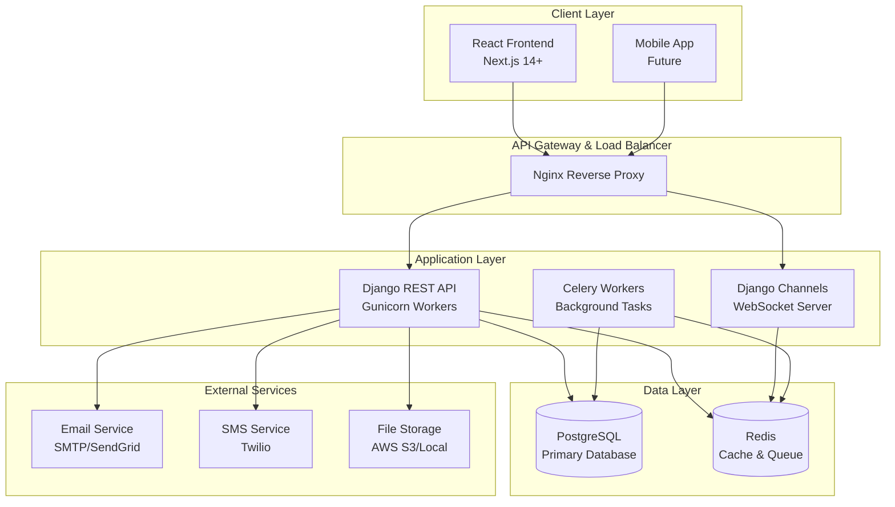
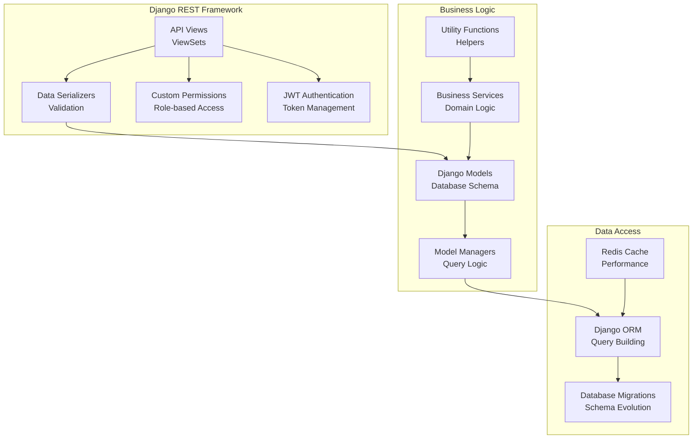
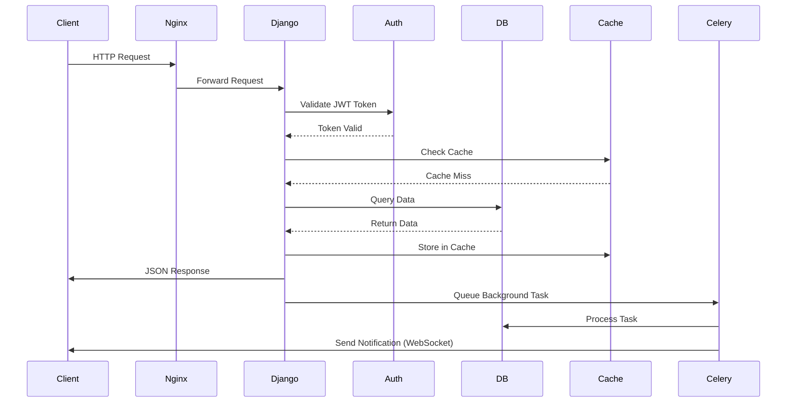
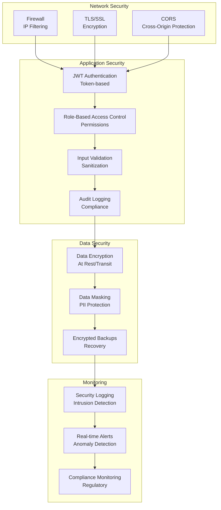
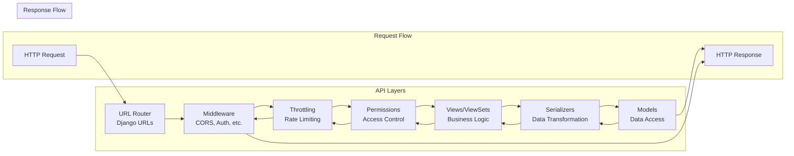
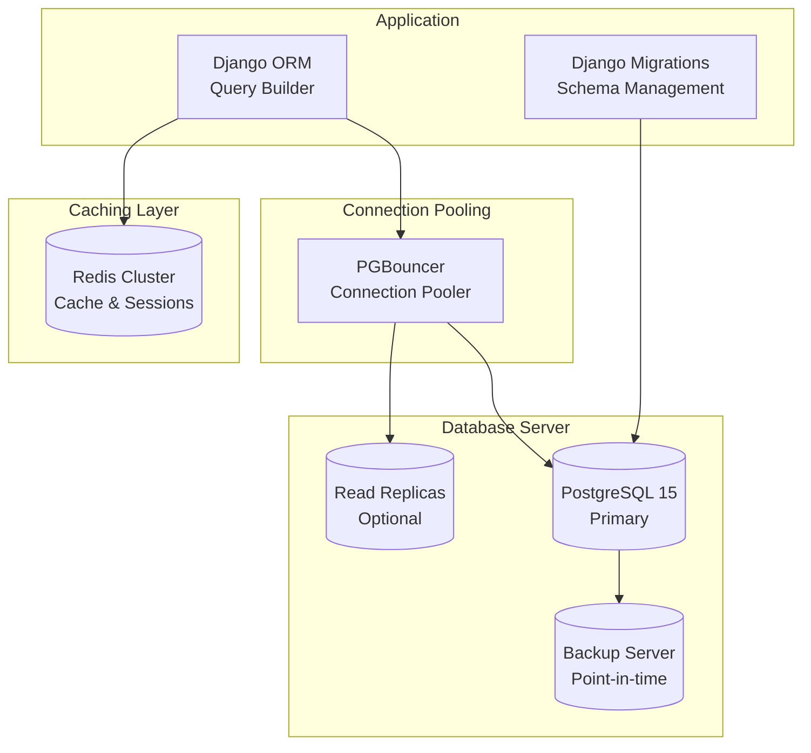
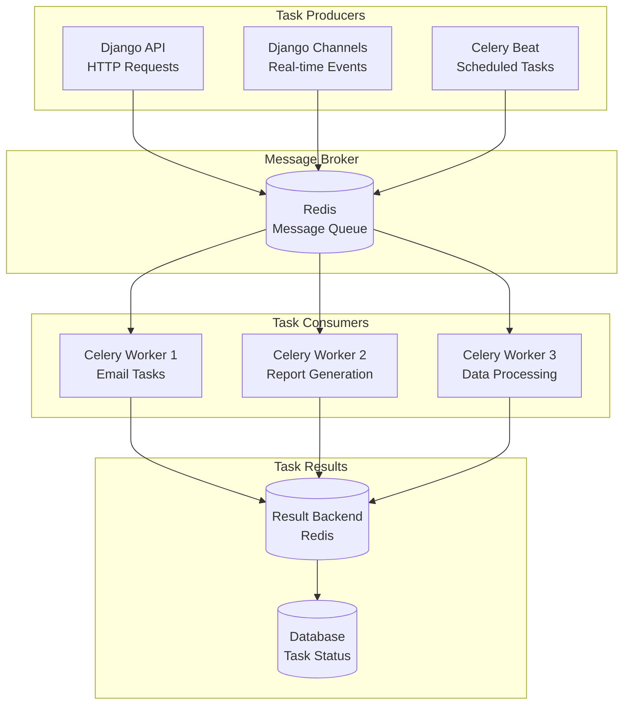
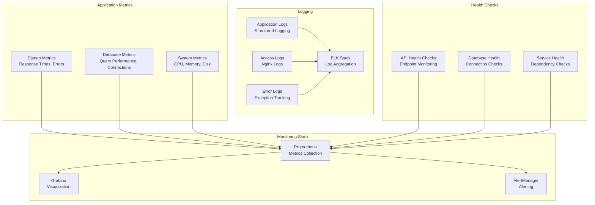

# System Architecture Diagrams

## High-Level System Architecture



## Component Architecture



## Data Flow Architecture



## Security Architecture



## Deployment Architecture

```mermaid
graph TB
    subgraph "Development"
        LocalDev[Local Development<br/>Docker Compose]
    end

    subgraph "Staging"
        Staging[Staging Environment<br/>Docker + Nginx]
    end

    subgraph "Production"
        LoadBalancer[Load Balancer<br/>Nginx/Haproxy]
        AppServers[Application Servers<br/>Docker + Gunicorn]
        Database[Database Cluster<br/>PostgreSQL + Redis]
        Monitoring[Monitoring Stack<br/>Prometheus + Grafana]
        Backup[Backup System<br/>Automated Backups]
    end

    LocalDev --> Staging
    Staging --> Production

    LoadBalancer --> AppServers
    AppServers --> Database
    AppServers --> Monitoring
    Database --> Backup
    Monitoring --> Alerts[Alerting System]
```

## API Architecture



## Database Architecture



## Asynchronous Task Architecture



## Monitoring & Observability



---

*Architecture diagrams for the CHELAL Hospital Management System as of September 27, 2025.*
