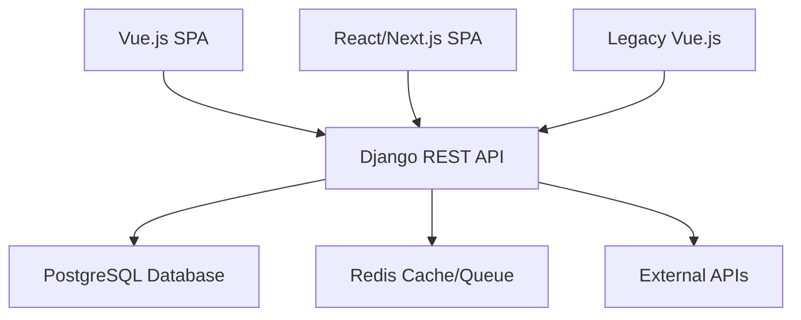
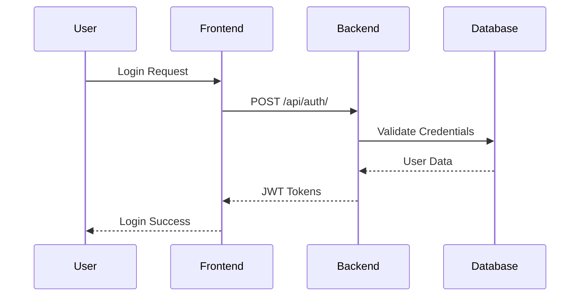
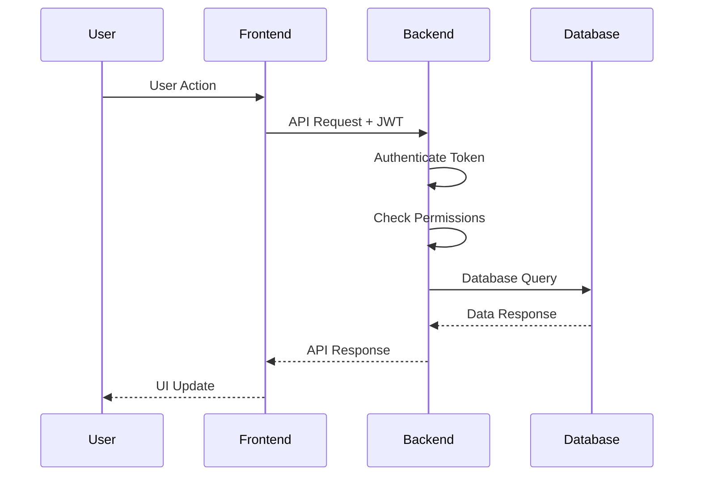
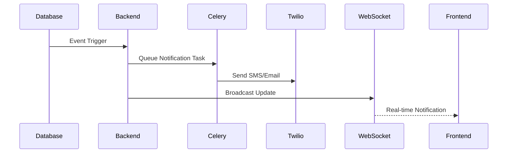
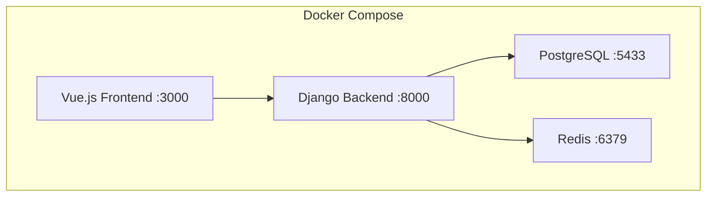
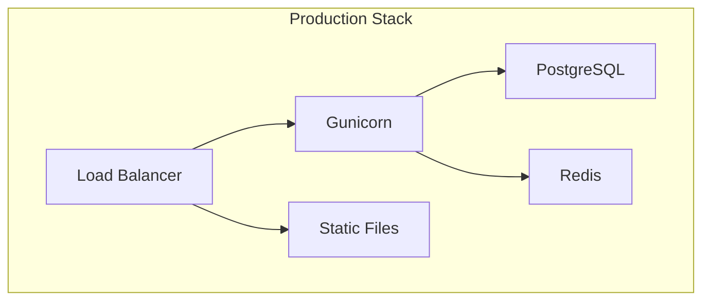

# 🏗️ System Architecture Overview

## High-Level Architecture

The Chelal Hospital Management System (HMS) follows a **microservices-inspired architecture** with multiple frontend implementations and a centralized backend API.

## Component Breakdown

### Frontend Applications

#### Vue.js Frontend (Primary)

- **Framework**: Vue 3.5.13 with TypeScript
- **State Management**: Vuex 4
- **Routing**: Vue Router 4
- **Build Tool**: Vite 6.3.5
- **Styling**: Tailwind CSS + PostCSS
- **HTTP Client**: Axios with JWT token management
- **Features**: Complete HMS feature set

#### React/Next.js Frontend (Alternative)

- **Framework**: Next.js 15.2.4 with React 19
- **UI Library**: Radix UI (complete component system)
- **Forms**: React Hook Form with validation
- **Charts**: Recharts for data visualization
- **Styling**: Tailwind CSS with class-variance-authority
- **Status**: UI components focused, partial implementation

#### Legacy Vue.js Frontend

- **Framework**: Vue 2/3 mixed
- **Status**: Basic setup, minimal features
- **Purpose**: Reference implementation

### Backend Services

#### Django REST API

- **Framework**: Django 4.2+ with Django REST Framework
- **Authentication**: JWT (djangorestframework-simplejwt)
- **Database**: PostgreSQL with Django ORM
- **Real-time**: WebSockets via Channels
- **Background Tasks**: Celery with Redis
- **External APIs**: Twilio (SMS/Email), RxNorm (drug data)

#### Database Layer

- **Primary Database**: PostgreSQL 15
- **Cache**: Redis for session storage and API caching
- **Message Queue**: Redis for Celery task queue
- **File Storage**: Local file system (configurable for S3)

#### External Services

- **SMS/Email**: Twilio API for notifications
- **Drug Data**: RxNorm API for drug interactions
- **Payment Processing**: Integrated billing system
- **Audit Logging**: Comprehensive security tracking

## Data Flow Architecture

### Authentication Flow

### API Request Flow

### Real-time Notifications Flow

## Security Architecture

### Authentication & Authorization

- **JWT Tokens**: Stateless authentication
- **Role-based Access Control**: 5 user roles
- **Permission Classes**: Django REST framework permissions
- **Session Management**: Secure token handling
- **Two-factor Authentication**: Optional 2FA support

### Data Security

- **Encryption**: Password hashing with Django's auth system
- **API Security**: CORS, CSRF protection
- **Audit Logging**: Complete activity tracking
- **Data Validation**: Comprehensive input validation
- **SQL Injection Protection**: Django ORM protection

## Deployment Architecture

### Development Environment

### Production Environment

## Scalability Considerations

### Horizontal Scaling

- **Database**: PostgreSQL clustering/read replicas
- **Cache**: Redis cluster for high availability
- **Backend**: Multiple Django instances behind load balancer
- **File Storage**: S3/cloud storage for static files

### Performance Optimizations

- **Database Indexing**: Optimized queries with proper indexing
- **Caching**: Redis caching for frequently accessed data
- **CDN**: Static asset delivery via CDN
- **Background Processing**: Celery for long-running tasks

## Monitoring & Observability

### Application Monitoring

- **Health Checks**: Django health check endpoints
- **Error Tracking**: Comprehensive error logging
- **Performance Monitoring**: Response time tracking
- **Database Monitoring**: Query performance analysis

### Business Intelligence

- **Audit Logs**: Complete user activity tracking
- **Usage Analytics**: Feature usage statistics
- **System Metrics**: Resource utilization monitoring
- **Error Analytics**: Error pattern analysis

## Integration Points

### External Systems

- **Laboratory Systems**: HL7 integration capability
- **Pharmacy Systems**: RxNorm drug database
- **Insurance Systems**: Claims processing integration
- **Telemedicine**: WebRTC video calling support

### API Integrations

- **Twilio**: SMS and email notifications
- **Payment Gateways**: Credit card processing
- **Calendar Systems**: Appointment synchronization
- **Document Management**: File upload and storage

## Future Architecture Considerations

### Microservices Migration

- **Service Decomposition**: Break down monolithic backend
- **API Gateway**: Centralized API management
- **Service Discovery**: Dynamic service registration
- **Event-driven Architecture**: Message-based communication

### Cloud-native Features

- **Container Orchestration**: Kubernetes deployment
- **Service Mesh**: Istio for service communication
- **Configuration Management**: Centralized configuration
- **Secret Management**: Secure credential storage

---

**Last Updated**: September 17, 2025
