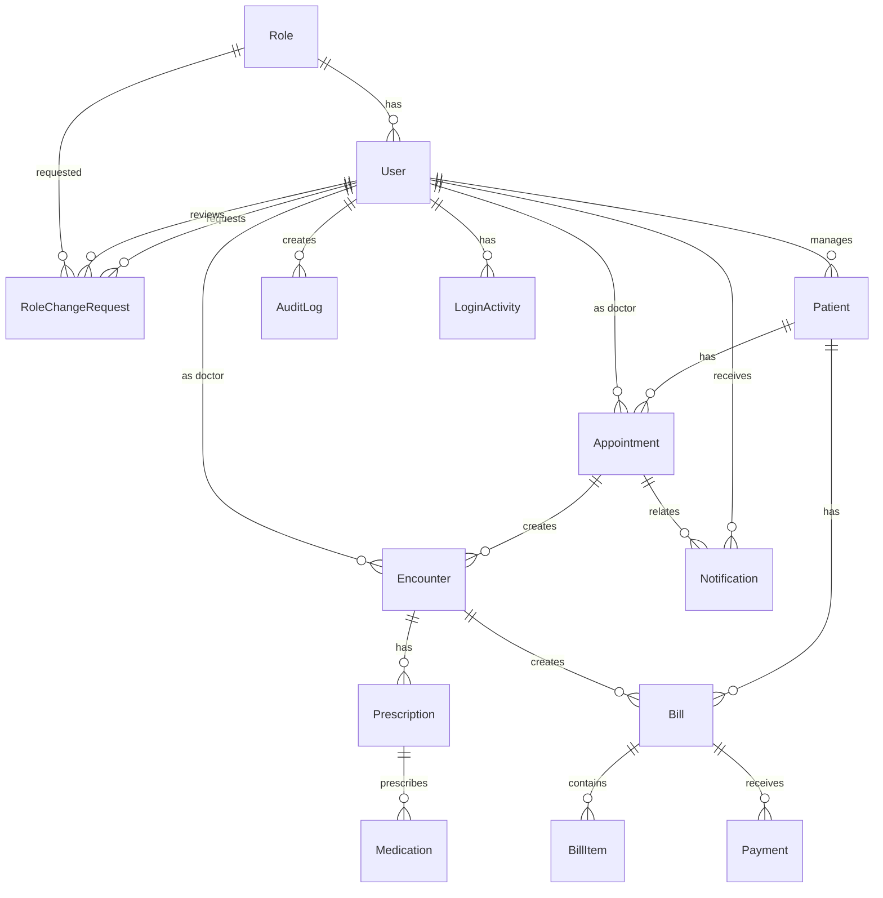

# Backend Documentation

## Overview

The CHELAL Hospital Management System backend is a Django REST Framework application that provides comprehensive hospital management functionality. It implements a role-based access control system with JWT authentication and supports patient management, appointments, billing, pharmacy, notifications, and audit logging.

## Architecture

### Technology Stack

- **Framework**: Django 4.2+ with Django REST Framework
- **Database**: PostgreSQL
- **Authentication**: JWT (JSON Web Tokens) with django-rest-framework-simplejwt
- **Background Tasks**: Celery with Redis
- **Real-time Communication**: Django Channels with WebSockets
- **Security**: Django Axes (brute force protection), CORS headers
- **File Storage**: Django's built-in file handling
- **API Documentation**: Auto-generated with DRF browsable API

### Application Structure

```
chelalBackend/
├── Backend/                 # Django project settings
│   ├── settings.py         # Main configuration
│   ├── urls.py            # Root URL configuration
│   ├── wsgi.py            # WSGI application
│   └── asgi.py            # ASGI application (WebSockets)
├── core/                   # Main application
│   ├── models.py          # Database models
│   ├── views.py           # API views and ViewSets
│   ├── serializers.py     # API serializers
│   ├── urls.py            # URL routing
│   ├── permissions.py     # Custom permissions
│   ├── admin.py           # Django admin configuration
│   └── migrations/        # Database migrations
├── manage.py              # Django management script
└── requirements.txt       # Python dependencies
```

## Data Model

### Core Entities

The system implements a comprehensive hospital management data model with the following main entities:

#### User Management

- **Role**: Defines user roles (Admin, Doctor, Nurse, Receptionist, etc.)
- **User**: Extended Django User model with role-based permissions
- **RoleChangeRequest**: Handles role change requests and approvals

#### Patient Management

- **Patient**: Patient demographic and medical information
- **Appointment**: Scheduled patient appointments
- **Encounter**: Medical encounters/visits
- **Prescription**: Medication prescriptions

#### Pharmacy & Inventory

- **Medication**: Available medications with stock tracking
- **Prescription**: Links medications to patient encounters

#### Billing & Payments

- **Bill**: Patient bills with line items
- **BillItem**: Individual bill items
- **Payment**: Payment records with multiple methods

#### System Features

- **Notification**: User notifications and alerts
- **AuditLog**: Comprehensive audit trail
- **LoginActivity**: User login tracking
- **SystemSetting**: Configurable system settings

## Database Schema

### Entity Relationship Diagram



### Detailed Model Relationships

#### User & Role Management

```mermaid
classDiagram
    class Role {
        +id: AutoField
        +name: CharField
        +description: TextField
        +__str__(): name
    }

    class User {
        +id: AutoField
        +username: CharField
        +email: EmailField
        +role: ForeignKey[Role]
        +language_preference: CharField
        +preferences: JSONField
        +profile_image: ImageField
        +two_factor_enabled: BooleanField
        +get_full_name(): str
    }

    class RoleChangeRequest {
        +id: AutoField
        +user: ForeignKey[User]
        +requested_role: ForeignKey[Role]
        +reason: TextField
        +status: CharField
        +reviewed_by: ForeignKey[User]
        +review_notes: TextField
        +created_at: DateTimeField
        +updated_at: DateTimeField
        +approve()
        +reject()
    }

    Role ||--o{ User : has
    Role ||--o{ RoleChangeRequest : requested
    User ||--o{ RoleChangeRequest : requests
    User ||--o{ RoleChangeRequest : reviews
```

#### Patient Care Workflow

```mermaid
classDiagram
    class Patient {
        +id: AutoField
        +unique_id: CharField
        +first_name: CharField
        +last_name: CharField
        +date_of_birth: DateField
        +gender: CharField
        +contact_info: CharField
        +address: CharField
        +known_allergies: TextField
        +__str__(): full_name
    }

    class Appointment {
        +id: AutoField
        +patient: ForeignKey[Patient]
        +doctor: ForeignKey[User]
        +date: DateField
        +time: TimeField
        +status: CharField
        +notes: TextField
        +created_at: DateTimeField
        +updated_at: DateTimeField
    }

    class Encounter {
        +id: AutoField
        +patient: ForeignKey[Patient]
        +appointment: ForeignKey[Appointment]
        +doctor: ForeignKey[User]
        +notes: TextField
        +diagnosis: TextField
        +created_at: DateTimeField
        +updated_at: DateTimeField
    }

    class Prescription {
        +id: AutoField
        +encounter: ForeignKey[Encounter]
        +medication_name: CharField
        +dosage: CharField
        +frequency: CharField
        +duration: CharField
        +instructions: TextField
        +created_at: DateTimeField
        +updated_at: DateTimeField
    }

    Patient ||--o{ Appointment : has
    Patient ||--o{ Encounter : visits
    Appointment ||--o{ Encounter : creates
    Encounter ||--o{ Prescription : prescribes
    User ||--o{ Appointment : "as doctor"
    User ||--o{ Encounter : "as doctor"
```

#### Billing System

```mermaid
classDiagram
    class Bill {
        +id: AutoField
        +patient: ForeignKey[Patient]
        +encounter: ForeignKey[Encounter]
        +date_issued: DateTimeField
        +total_amount: DecimalField
        +is_paid: BooleanField
        +notes: TextField
        +__str__(): bill_info
    }

    class BillItem {
        +id: AutoField
        +bill: ForeignKey[Bill]
        +description: CharField
        +amount: DecimalField
        +quantity: PositiveIntegerField
        +__str__(): item_info
    }

    class Payment {
        +id: AutoField
        +bill: ForeignKey[Bill]
        +amount: DecimalField
        +payment_date: DateTimeField
        +method: CharField
        +reference: CharField
        +received_by: ForeignKey[User]
        +__str__(): payment_info
    }

    Patient ||--o{ Bill : billed
    Encounter ||--o{ Bill : generates
    Bill ||--o{ BillItem : contains
    Bill ||--o{ Payment : receives
    User ||--o{ Payment : receives
```

## API Endpoints

### Authentication Endpoints

| Method | Endpoint | Description | Permissions |
|--------|----------|-------------|-------------|
| POST | `/api/auth/` | Obtain JWT token | AllowAny |
| POST | `/api/auth/refresh/` | Refresh JWT token | AllowAny |
| POST | `/api/register/` | User registration | AllowAny |

### Core Resources

#### Roles

| Method | Endpoint | Description | Permissions |
|--------|----------|-------------|-------------|
| GET | `/api/roles/` | List all roles | Admin/ReadOnly |
| POST | `/api/roles/` | Create role | Admin |
| GET | `/api/roles/{id}/` | Get role details | Admin/ReadOnly |
| PUT | `/api/roles/{id}/` | Update role | Admin |
| DELETE | `/api/roles/{id}/` | Delete role | Admin |

#### Users

| Method | Endpoint | Description | Permissions |
|--------|----------|-------------|-------------|
| GET | `/api/users/` | List users | Admin/ReadOnly |
| POST | `/api/users/` | Create user | Admin |
| GET | `/api/users/me/` | Get current user | Authenticated |
| GET | `/api/users/{id}/` | Get user details | Admin/ReadOnly |
| PUT | `/api/users/{id}/` | Update user | Admin |
| DELETE | `/api/users/{id}/` | Delete user | Admin |

#### Patients

| Method | Endpoint | Description | Permissions |
|--------|----------|-------------|-------------|
| GET | `/api/patients/` | List patients | Authenticated |
| POST | `/api/patients/` | Create patient | Authenticated |
| GET | `/api/patients/{id}/` | Get patient details | Authenticated |
| PUT | `/api/patients/{id}/` | Update patient | Authenticated |
| DELETE | `/api/patients/{id}/` | Delete patient | Admin |

#### Appointments

| Method | Endpoint | Description | Permissions |
|--------|----------|-------------|-------------|
| GET | `/api/appointments/` | List appointments | Authenticated |
| POST | `/api/appointments/` | Create appointment | Authenticated |
| GET | `/api/appointments/{id}/` | Get appointment | Authenticated |
| PUT | `/api/appointments/{id}/` | Update appointment | Authenticated |
| DELETE | `/api/appointments/{id}/` | Delete appointment | Admin |

#### Encounters

| Method | Endpoint | Description | Permissions |
|--------|----------|-------------|-------------|
| GET | `/api/encounters/` | List encounters | Authenticated |
| POST | `/api/encounters/` | Create encounter | Doctor |
| GET | `/api/encounters/{id}/` | Get encounter | Authenticated |
| PUT | `/api/encounters/{id}/` | Update encounter | Doctor |
| DELETE | `/api/encounters/{id}/` | Delete encounter | Admin |

#### Pharmacy

| Method | Endpoint | Description | Permissions |
|--------|----------|-------------|-------------|
| GET | `/api/medications/` | List medications | Authenticated |
| POST | `/api/medications/` | Add medication | Admin |
| GET | `/api/medications/{id}/` | Get medication | Authenticated |
| PUT | `/api/medications/{id}/` | Update medication | Admin |
| DELETE | `/api/medications/{id}/` | Delete medication | Admin |

| Method | Endpoint | Description | Permissions |
|--------|----------|-------------|-------------|
| GET | `/api/prescriptions/` | List prescriptions | Authenticated |
| POST | `/api/prescriptions/` | Create prescription | Doctor |
| GET | `/api/prescriptions/{id}/` | Get prescription | Authenticated |
| PUT | `/api/prescriptions/{id}/` | Update prescription | Doctor |
| DELETE | `/api/prescriptions/{id}/` | Delete prescription | Admin |

#### Billing

| Method | Endpoint | Description | Permissions |
|--------|----------|-------------|-------------|
| GET | `/api/bills/` | List bills | Authenticated |
| POST | `/api/bills/` | Create bill | Authenticated |
| GET | `/api/bills/{id}/` | Get bill | Authenticated |
| PUT | `/api/bills/{id}/` | Update bill | Authenticated |
| DELETE | `/api/bills/{id}/` | Delete bill | Admin |

| Method | Endpoint | Description | Permissions |
|--------|----------|-------------|-------------|
| GET | `/api/payments/` | List payments | Authenticated |
| POST | `/api/payments/` | Record payment | Authenticated |
| GET | `/api/payments/{id}/` | Get payment | Authenticated |
| PUT | `/api/payments/{id}/` | Update payment | Admin |
| DELETE | `/api/payments/{id}/` | Delete payment | Admin |

#### Role Change Requests

| Method | Endpoint | Description | Permissions |
|--------|----------|-------------|-------------|
| GET | `/api/role-change-requests/` | List requests | Authenticated* |
| POST | `/api/role-change-requests/` | Create request | Authenticated |
| GET | `/api/role-change-requests/{id}/` | Get request | Authenticated* |
| PUT | `/api/role-change-requests/{id}/` | Update request | Owner |
| DELETE | `/api/role-change-requests/{id}/` | Delete request | Admin |
| POST | `/api/role-change-requests/{id}/approve/` | Approve request | Admin |
| POST | `/api/role-change-requests/{id}/reject/` | Reject request | Admin |
| POST | `/api/role-change-requests/assign_role/` | Direct role assignment | Admin |

*Users see only their own requests; Admins see all requests

### Reporting Endpoints

| Method | Endpoint | Description | Permissions |
|--------|----------|-------------|-------------|
| GET | `/api/dashboard/` | Main dashboard data | Authenticated |
| GET | `/api/dashboard-stats/` | Dashboard statistics | Authenticated |
| GET | `/api/report/patient_count/` | Patient count report | Authenticated |
| GET | `/api/report/appointments_today/` | Today's appointments | Authenticated |
| GET | `/api/report/appointments_by_doctor/` | Appointments by doctor | Authenticated |
| GET | `/api/report/top_prescribed_medications/` | Top medications | Authenticated |
| GET | `/api/report/billing-stats/` | Billing statistics | Authenticated |

### System Endpoints

| Method | Endpoint | Description | Permissions |
|--------|----------|-------------|-------------|
| GET | `/api/notifications/` | User notifications | Authenticated |
| GET | `/api/audit-logs/` | Audit logs | Admin |
| GET | `/api/login-activity/` | Login activity | Admin |
| GET | `/api/system-settings/` | System settings | Admin |
| GET | `/api/profile/` | User profile | Authenticated |
| PUT | `/api/profile/` | Update profile | Authenticated |
| GET | `/api/preferences/` | User preferences | Authenticated |
| PUT | `/api/preferences/` | Update preferences | Authenticated |
| GET | `/api/health/` | Health check | AllowAny |
| POST | `/api/sync_offline_data/` | Sync offline data | Authenticated |

## Authentication & Authorization

### JWT Authentication

The system uses JWT tokens for authentication:

1. **Token Obtain**: `POST /api/auth/` with username/email and password
2. **Token Refresh**: `POST /api/auth/refresh/` with refresh token
3. **Authorization**: Include `Authorization: Bearer <access_token>` header

### Role-Based Access Control

| Role | Permissions |
|------|-------------|
| **Admin** | Full system access, user management, system settings |
| **Doctor** | Patient care, prescriptions, encounters, appointments |
| **Nurse** | Patient care, basic medical tasks |
| **Receptionist** | Appointments, patient registration, basic billing |
| **Patient** | View own records, appointments, bills (future feature) |

### Custom Permissions

- `IsAdminOrReadOnly`: Admin full access, others read-only
- `IsDoctorOrReadOnly`: Doctors full access, others read-only
- `IsReceptionistOrReadOnly`: Receptionists full access, others read-only

## Data Serialization

### Request/Response Formats

All API endpoints use JSON format. Example request/response structures:

#### User Registration
```json
POST /api/register/
{
  "username": "johndoe",
  "email": "john@example.com",
  "password": "securepassword",
  "first_name": "John",
  "last_name": "Doe",
  "role_id": 2
}
```

#### Patient Creation
```json
POST /api/patients/
{
  "first_name": "Jane",
  "last_name": "Smith",
  "date_of_birth": "1990-01-15",
  "gender": "F",
  "contact_info": "+1234567890",
  "address": "123 Main St",
  "known_allergies": "Penicillin"
}
```

#### Appointment Creation
```json
POST /api/appointments/
{
  "patient": 1,
  "doctor": 2,
  "date": "2025-01-15",
  "time": "10:00:00",
  "notes": "Regular checkup"
}
```

## Background Tasks & Notifications

### Celery Integration

The system uses Celery for background task processing:

- **Email notifications** for appointments
- **Report generation**
- **Data synchronization**
- **Audit log processing**

### Real-time Features

Using Django Channels for WebSocket communication:

- **Live notifications**
- **Real-time appointment updates**
- **Dashboard live data**

## Security Features

### Implemented Security Measures

1. **JWT Authentication** with token refresh
2. **Brute force protection** via Django Axes
3. **CORS protection** with allowed origins
4. **CSRF protection** on sensitive endpoints
5. **Input validation** via DRF serializers
6. **SQL injection prevention** via Django ORM
7. **Audit logging** for all critical operations
8. **Two-factor authentication** support (configurable)

### Security Headers

- `X-Frame-Options: DENY`
- `X-Content-Type-Options: nosniff`
- `X-XSS-Protection: 1; mode=block`
- CORS headers configured

## Deployment & Configuration

### Environment Variables

| Variable | Description | Default |
|----------|-------------|---------|
| `DEBUG` | Enable debug mode | `True` |
| `SECRET_KEY` | Django secret key | Generated |
| `DB_NAME` | Database name | `chelal_hms` |
| `DB_USER` | Database user | `postgres` |
| `DB_PASSWORD` | Database password | `''` |
| `DB_HOST` | Database host | `localhost` |
| `DB_PORT` | Database port | `5432` |
| `REDIS_URL` | Redis URL for Celery | `redis://localhost:6379/0` |

### Docker Deployment

The application is containerized with Docker:

- **Backend**: Gunicorn with 1 worker, 2 threads
- **Database**: PostgreSQL 15
- **Cache/Queue**: Redis Alpine
- **Reverse Proxy**: Nginx

### Production Considerations

1. **Database**: Use connection pooling
2. **Caching**: Implement Redis caching
3. **Static Files**: Use CDN for static assets
4. **Monitoring**: Implement health checks and logging
5. **Backup**: Regular database backups
6. **SSL/TLS**: HTTPS everywhere
7. **Rate Limiting**: Implement API rate limiting

## Development & Testing

### Running Locally

```bash
# Install dependencies
pip install -r requirements.txt

# Run migrations
python manage.py migrate

# Create superuser
python manage.py createsuperuser

# Run development server
python manage.py runserver

# Run Celery worker
celery -A Backend worker -l info
```

### Testing

```bash
# Run all tests
python manage.py test

# Run with coverage
coverage run manage.py test
coverage report
```

### API Testing

Use the included Postman collection (`chelal_backend_api.postman_collection.json`) for testing all endpoints.

## Future Enhancements

### Planned Features

1. **Patient Portal**: Self-service patient features
2. **Telemedicine**: Video consultation integration
3. **Advanced Analytics**: ML-based insights
4. **Mobile App**: React Native mobile application
5. **Integration APIs**: HL7 FHIR compliance
6. **Advanced Reporting**: Custom report builder
7. **Inventory Management**: Advanced pharmacy features
8. **Emergency Module**: Emergency response features

### Scalability Considerations

1. **Database Sharding**: For multi-tenant deployments
2. **Microservices**: Break down monolithic architecture
3. **API Gateway**: Centralized API management
4. **Message Queue**: Advanced queuing with RabbitMQ
5. **CDN Integration**: Global content delivery
6. **Load Balancing**: Multiple application instances

---

*This documentation reflects the current state of the CHELAL Hospital Management System backend as of September 27, 2025.*
