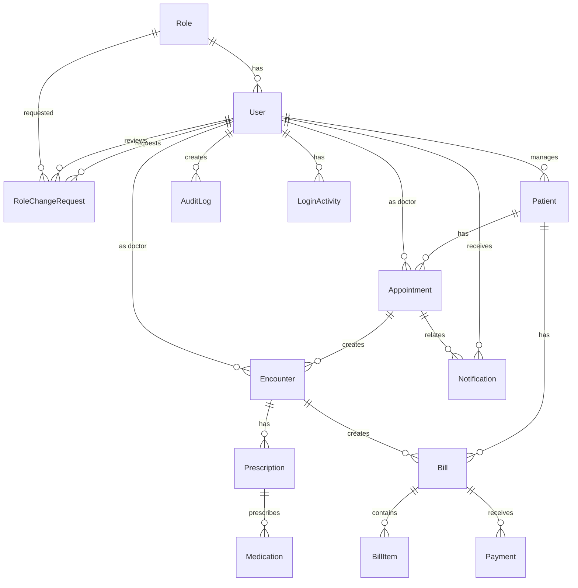

# Database Documentation

## Database Overview

The CHELAL Hospital Management System uses PostgreSQL as its primary database with Redis for caching and session management. The database schema is designed to support comprehensive hospital operations including patient management, appointments, billing, pharmacy, and audit logging.

## Database Configuration

### Connection Settings

| Setting | Development | Production |
|---------|-------------|------------|
| **Engine** | `django.db.backends.postgresql` | `django.db.backends.postgresql` |
| **Host** | `localhost` (Docker: `db`) | Production PostgreSQL host |
| **Port** | `5432` (Docker: `5433`) | `5432` |
| **Database** | `chelal_hms` (Docker: `chelal_db`) | Production database name |
| **User** | `postgres` (Docker: `chelal_user`) | Production database user |
| **Password** | Empty (Docker: `chelal_password`) | Production password |

### Environment Variables

```bash
DB_NAME=chelal_db
DB_USER=chelal_user
DB_PASSWORD=chelal_password
DB_HOST=localhost
DB_PORT=5433
```

## Database Schema

### Core Tables

#### 1. Role Management

**`core_role`**

```sql
CREATE TABLE core_role (
    id SERIAL PRIMARY KEY,
    name VARCHAR(50) UNIQUE NOT NULL,
    description TEXT
);
```

**`core_rolechangerequest`**

```sql
CREATE TABLE core_rolechangerequest (
    id SERIAL PRIMARY KEY,
    user_id INTEGER REFERENCES core_user(id),
    requested_role_id INTEGER REFERENCES core_role(id),
    reason TEXT NOT NULL,
    status VARCHAR(20) DEFAULT 'pending',
    reviewed_by_id INTEGER REFERENCES core_user(id) NULL,
    review_notes TEXT,
    created_at TIMESTAMP WITH TIME ZONE DEFAULT NOW(),
    updated_at TIMESTAMP WITH TIME ZONE DEFAULT NOW()
);
```

#### 2. User Management

**`core_user`** (extends Django's auth_user)

```sql
CREATE TABLE core_user (
    -- Django auth_user fields
    id SERIAL PRIMARY KEY,
    username VARCHAR(150) UNIQUE NOT NULL,
    email VARCHAR(254) UNIQUE,
    first_name VARCHAR(150),
    last_name VARCHAR(150),
    date_joined TIMESTAMP WITH TIME ZONE DEFAULT NOW(),
    last_login TIMESTAMP WITH TIME ZONE NULL,
    is_active BOOLEAN DEFAULT TRUE,
    is_staff BOOLEAN DEFAULT FALSE,
    is_superuser BOOLEAN DEFAULT FALSE,
    password VARCHAR(128) NOT NULL,

    -- Custom fields
    role_id INTEGER REFERENCES core_role(id) NULL,
    language_preference VARCHAR(10) DEFAULT 'en',
    preferences JSONB DEFAULT '{}',
    profile_image VARCHAR(100) NULL,
    two_factor_enabled BOOLEAN DEFAULT FALSE,
    two_factor_secret VARCHAR(64) NULL
);
```

#### 3. Patient Management

**`core_patient`**

```sql
CREATE TABLE core_patient (
    id SERIAL PRIMARY KEY,
    unique_id VARCHAR(32) UNIQUE NOT NULL,
    first_name VARCHAR(100) NOT NULL,
    last_name VARCHAR(100) NOT NULL,
    date_of_birth DATE NOT NULL,
    gender VARCHAR(10) NOT NULL,
    contact_info VARCHAR(255),
    address VARCHAR(255),
    known_allergies TEXT,
    created_at TIMESTAMP WITH TIME ZONE DEFAULT NOW(),
    updated_at TIMESTAMP WITH TIME ZONE DEFAULT NOW()
);
```

#### 4. Appointment System

**`core_appointment`**

```sql
CREATE TABLE core_appointment (
    id SERIAL PRIMARY KEY,
    patient_id INTEGER REFERENCES core_patient(id) ON DELETE CASCADE,
    doctor_id INTEGER REFERENCES core_user(id) ON DELETE CASCADE,
    date DATE NOT NULL,
    time TIME NOT NULL,
    status VARCHAR(20) DEFAULT 'scheduled',
    notes TEXT,
    created_at TIMESTAMP WITH TIME ZONE DEFAULT NOW(),
    updated_at TIMESTAMP WITH TIME ZONE DEFAULT NOW()
);
```

#### 5. Medical Encounters

**`core_encounter`**

```sql
CREATE TABLE core_encounter (
    id SERIAL PRIMARY KEY,
    patient_id INTEGER REFERENCES core_patient(id) ON DELETE CASCADE,
    appointment_id INTEGER REFERENCES core_appointment(id) NULL,
    doctor_id INTEGER REFERENCES core_user(id) ON DELETE CASCADE,
    notes TEXT NOT NULL,
    diagnosis TEXT,
    created_at TIMESTAMP WITH TIME ZONE DEFAULT NOW(),
    updated_at TIMESTAMP WITH TIME ZONE DEFAULT NOW()
);
```

#### 6. Pharmacy Management

**`core_medication`**

```sql
CREATE TABLE core_medication (
    id SERIAL PRIMARY KEY,
    name VARCHAR(255) UNIQUE NOT NULL,
    generic_name VARCHAR(255),
    description TEXT,
    unit VARCHAR(50) DEFAULT 'tablet',
    current_stock INTEGER DEFAULT 0,
    reorder_level INTEGER DEFAULT 10,
    updated_at TIMESTAMP WITH TIME ZONE DEFAULT NOW()
);
```

**`core_prescription`**

```sql
CREATE TABLE core_prescription (
    id SERIAL PRIMARY KEY,
    encounter_id INTEGER REFERENCES core_encounter(id) ON DELETE CASCADE,
    medication_name VARCHAR(255) NOT NULL,
    dosage VARCHAR(100) NOT NULL,
    frequency VARCHAR(100) NOT NULL,
    duration VARCHAR(100),
    instructions TEXT,
    created_at TIMESTAMP WITH TIME ZONE DEFAULT NOW(),
    updated_at TIMESTAMP WITH TIME ZONE DEFAULT NOW()
);
```

#### 7. Billing System

**`core_bill`**

```sql
CREATE TABLE core_bill (
    id SERIAL PRIMARY KEY,
    patient_id INTEGER REFERENCES core_patient(id) ON DELETE CASCADE,
    encounter_id INTEGER REFERENCES core_encounter(id) NULL,
    date_issued TIMESTAMP WITH TIME ZONE DEFAULT NOW(),
    total_amount DECIMAL(12,2) DEFAULT 0,
    is_paid BOOLEAN DEFAULT FALSE,
    notes TEXT
);
```

**`core_billitem`**

```sql
CREATE TABLE core_billitem (
    id SERIAL PRIMARY KEY,
    bill_id INTEGER REFERENCES core_bill(id) ON DELETE CASCADE,
    description VARCHAR(255) NOT NULL,
    amount DECIMAL(10,2) NOT NULL,
    quantity INTEGER DEFAULT 1
);
```

**`core_payment`**

```sql
CREATE TABLE core_payment (
    id SERIAL PRIMARY KEY,
    bill_id INTEGER REFERENCES core_bill(id) ON DELETE CASCADE,
    amount DECIMAL(10,2) NOT NULL,
    payment_date TIMESTAMP WITH TIME ZONE DEFAULT NOW(),
    method VARCHAR(50) NOT NULL,
    reference VARCHAR(100),
    received_by_id INTEGER REFERENCES core_user(id) NULL
);
```

#### 8. System Features

**`core_notification`**

```sql
CREATE TABLE core_notification (
    id SERIAL PRIMARY KEY,
    user_id INTEGER REFERENCES core_user(id) ON DELETE CASCADE,
    title VARCHAR(255) DEFAULT 'Notification',
    message TEXT NOT NULL,
    type VARCHAR(50),
    is_read BOOLEAN DEFAULT FALSE,
    related_appointment_id INTEGER REFERENCES core_appointment(id) NULL,
    created_at TIMESTAMP WITH TIME ZONE DEFAULT NOW()
);
```

**`core_auditlog`**

```sql
CREATE TABLE core_auditlog (
    id SERIAL PRIMARY KEY,
    user_id INTEGER REFERENCES core_user(id) NULL,
    action VARCHAR(32) NOT NULL,
    object_type VARCHAR(64) NULL,
    object_id VARCHAR(64) NULL,
    description TEXT,
    timestamp TIMESTAMP WITH TIME ZONE DEFAULT NOW(),
    details JSONB NULL
);
```

**`core_loginactivity`**

```sql
CREATE TABLE core_loginactivity (
    id SERIAL PRIMARY KEY,
    user_id INTEGER REFERENCES core_user(id) ON DELETE CASCADE,
    timestamp TIMESTAMP WITH TIME ZONE DEFAULT NOW(),
    ip_address INET NULL,
    user_agent TEXT,
    status VARCHAR(16) DEFAULT 'success'
);
```

**`core_systemsetting`**

```sql
CREATE TABLE core_systemsetting (
    id SERIAL PRIMARY KEY,
    key VARCHAR(100) UNIQUE NOT NULL,
    value TEXT NOT NULL,
    description TEXT,
    category VARCHAR(50) DEFAULT 'general',
    is_public BOOLEAN DEFAULT FALSE,
    updated_at TIMESTAMP WITH TIME ZONE DEFAULT NOW()
);
```

## Indexes and Constraints

### Performance Indexes

```sql
-- Patient searches
CREATE INDEX idx_patient_unique_id ON core_patient(unique_id);
CREATE INDEX idx_patient_name ON core_patient(first_name, last_name);

-- Appointment queries
CREATE INDEX idx_appointment_date ON core_appointment(date);
CREATE INDEX idx_appointment_doctor_date ON core_appointment(doctor_id, date);
CREATE INDEX idx_appointment_patient ON core_appointment(patient_id);

-- Audit logging
CREATE INDEX idx_auditlog_timestamp ON core_auditlog(timestamp);
CREATE INDEX idx_auditlog_user ON core_auditlog(user_id);

-- Billing queries
CREATE INDEX idx_bill_patient ON core_bill(patient_id);
CREATE INDEX idx_bill_date ON core_bill(date_issued);
CREATE INDEX idx_payment_date ON core_payment(payment_date);

-- Role change requests
CREATE INDEX idx_rolechange_user ON core_rolechangerequest(user_id);
CREATE INDEX idx_rolechange_status ON core_rolechangerequest(status);
```

### Foreign Key Constraints

All foreign key relationships include appropriate CASCADE or SET NULL behaviors:

- **User deletion**: SET NULL for audit logs, payments, role change reviews
- **Patient deletion**: CASCADE for all related records (appointments, bills, etc.)
- **Appointment deletion**: SET NULL for encounters
- **Encounter deletion**: CASCADE for prescriptions and bills
- **Bill deletion**: CASCADE for bill items and payments

## Data Relationships

### Entity Relationship Diagram



## Migration Strategy

### Django Migrations

The system uses Django's migration framework for schema evolution:

```bash
# Create new migration
python manage.py makemigrations

# Apply migrations
python manage.py migrate

# Show migration status
python manage.py showmigrations

# Create SQL for migration
python manage.py sqlmigrate core 0001
```

### Migration Files

Current migration files in `core/migrations/`:

- `0001_initial.py` - Initial schema creation
- `0002_rolechangerequest.py` - Role change request model

## Backup and Recovery

### Automated Backups

```bash
# Database backup
pg_dump -h localhost -p 5433 -U chelal_user -d chelal_db > backup.sql

# Restore from backup
psql -h localhost -p 5433 -U chelal_user -d chelal_db < backup.sql
```

### Backup Strategy

1. **Daily backups** of database
2. **Transaction log backups** for point-in-time recovery
3. **File system backups** for media files
4. **Offsite storage** for disaster recovery

## Performance Optimization

### Query Optimization

1. **Select related fields** to reduce N+1 queries
2. **Use database indexes** on frequently queried fields
3. **Implement pagination** for large result sets
4. **Use database views** for complex aggregations

### Caching Strategy

1. **Redis caching** for frequently accessed data
2. **Database query result caching**
3. **Session storage** in Redis
4. **API response caching** for read-heavy endpoints

## Monitoring and Maintenance

### Database Monitoring

```sql
-- Active connections
SELECT count(*) FROM pg_stat_activity;

-- Table sizes
SELECT schemaname, tablename, pg_size_pretty(pg_total_relation_size(schemaname||'.'||tablename)) as size
FROM pg_tables
WHERE schemaname = 'public'
ORDER BY pg_total_relation_size(schemaname||'.'||tablename) DESC;

-- Index usage
SELECT indexname, idx_scan, idx_tup_read, idx_tup_fetch
FROM pg_stat_user_indexes
ORDER BY idx_scan DESC;
```

### Maintenance Tasks

1. **VACUUM ANALYZE** for table optimization
2. **REINDEX** for index maintenance
3. **Monitor slow queries** and optimize
4. **Archive old audit logs** and notifications

## Security Considerations

### Data Protection

1. **Encryption at rest** using PostgreSQL's encryption features
2. **SSL/TLS** for data in transit
3. **Row-level security** for multi-tenant scenarios (future)
4. **Data masking** for sensitive information in logs

### Access Control

1. **Database user roles** with minimal privileges
2. **Application-level permissions** via Django
3. **Audit logging** of all data access
4. **Connection pooling** to prevent resource exhaustion

---

*Database documentation for the CHELAL Hospital Management System as of September 27, 2025.*
