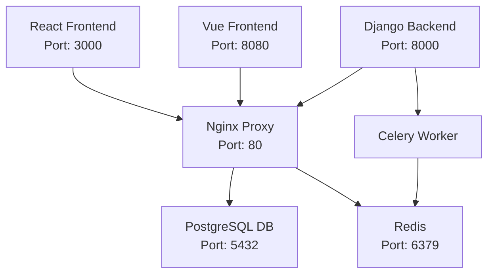

# 🐳 Docker Setup and Deployment Guide

## Overview

This guide covers the complete Docker containerization setup for the Chelal Hospital Management System, including React frontend, Vue frontend, Django backend, PostgreSQL database, Redis cache, and Nginx reverse proxy.

## 📋 Prerequisites

- Docker Engine 24.0+
- Docker Compose 2.20+
- At least 4GB RAM available
- 10GB free disk space

## 🏗️ Architecture

The Docker setup includes the following services:



## 🚀 Quick Start

### 1. Clone and Navigate to Project Directory

```bash
cd /home/c_jalloh/Documents/School/Second\ Semester/ITCA\ Week/code
```

### 2. Run the Automated Setup Script

```bash
# Make the script executable (if not already)
chmod +x start-chelal-hms.sh

# Run the setup
./start-chelal-hms.sh
```

This script will:

- Check Docker installation
- Create necessary environment files
- Build all Docker images
- Start all services
- Run health checks

### 3. Access the Application

- **React Frontend**: `http://localhost`
- **Vue Frontend**: `http://localhost/vue`
- **Django API**: `http://localhost/api`
- **Admin Panel**: `http://localhost/admin`

## 📁 File Structure

```
chelal-hms/
├── docker-compose.yml          # Main orchestration file
├── chelal-hms-react/
│   ├── Dockerfile             # React frontend container config
│   └── ...                    # React source code
├── chelal-hms-vue/
│   ├── Dockerfile             # Vue frontend container config
│   └── ...                    # Vue source code
├── chelalBackend/
│   ├── Dockerfile             # Django backend container config
│   ├── requirements.txt       # Python dependencies
│   └── ...                    # Django source code
├── nginx.conf                 # Reverse proxy configuration
├── start-chelal-hms.sh        # Automated startup script
├── cleanup-chelal-hms.sh      # Cleanup script
└── health-check.sh            # Health verification script
```

## 🔧 Manual Setup (Alternative)

If you prefer manual setup:

### 1. Environment Configuration

Create a `.env` file in the project root:

```bash
# Database Configuration
POSTGRES_DB=chelal_hms
POSTGRES_USER=chelal_user
POSTGRES_PASSWORD=chelal_password
POSTGRES_HOST=db
POSTGRES_PORT=5432

# Django Configuration
DJANGO_SECRET_KEY=your-secret-key-here
DJANGO_DEBUG=False
DJANGO_ALLOWED_HOSTS=localhost,127.0.0.1

# Redis Configuration
REDIS_URL=redis://redis:6379/0

# Email Configuration (optional)
EMAIL_HOST=smtp.gmail.com
EMAIL_PORT=587
EMAIL_USE_TLS=True
EMAIL_HOST_USER=your-email@gmail.com
EMAIL_HOST_PASSWORD=your-app-password
```

### 2. Build and Start Services

```bash
# Build all images
docker-compose build

# Start all services
docker-compose up -d

# View logs
docker-compose logs -f
```

### 3. Database Setup

```bash
# Run Django migrations
docker-compose exec backend python manage.py migrate

# Create superuser (optional)
docker-compose exec backend python manage.py createsuperuser

# Load initial data (if available)
docker-compose exec backend python manage.py loaddata initial_data.json
```

## 🏥 Service Details

### React Frontend (chelal-hms-react)

- **Base Image**: node:18-alpine
- **Build Process**: npm ci && npm run build
- **Development Mode**: npm run dev (with hot reloading)
- **Port**: 3000 (internal), mapped to host port 3001
- **Features**:
  - Next.js 15.2.4 with React 19
  - TypeScript support
  - Tailwind CSS styling
  - Google Calendar integration

### Vue Frontend (chelal-hms-vue)

- **Base Image**: node:18-alpine
- **Build Process**: npm ci && npm run build
- **Development Mode**: npm run dev -- --host 0.0.0.0
- **Port**: 8080 (internal), mapped to host port 8080
- **Features**:
  - Vue 3.5.13 with TypeScript
  - Vite build system
  - Vue Router and Vuex
  - Tailwind CSS + PostCSS

### Django Backend (chelalBackend)

- **Base Image**: python:3.12-slim
- **Build Process**: pip install -r requirements.txt
- **WSGI Server**: Gunicorn
- **Port**: 8000 (internal)
- **Features**:
  - Django 4.2+ with DRF
  - PostgreSQL database
  - Redis caching
  - Celery background tasks
  - JWT authentication

### Database (PostgreSQL)

- **Base Image**: postgres:15-alpine
- **Port**: 5432 (internal)
- **Persistent Storage**: ./postgres_data volume
- **Features**:
  - Full ACID compliance
  - JSON field support
  - PostGIS extension ready

### Cache/Message Queue (Redis)

- **Base Image**: redis:7-alpine
- **Port**: 6379 (internal)
- **Persistent Storage**: ./redis_data volume
- **Features**:
  - In-memory data structure store
  - Pub/Sub messaging
  - Celery broker

### Reverse Proxy (Nginx)

- **Base Image**: nginx:alpine
- **Port**: 80 (external)
- **Configuration**: Custom nginx.conf
- **Features**:
  - Load balancing
  - SSL termination ready
  - Static file serving
  - API routing

## 🔍 Health Checks and Monitoring

### Automated Health Check

```bash
# Run the health check script
./health-check.sh
```

This script verifies:

- All containers are running
- Services are responding on expected ports
- Database connectivity
- API endpoints accessibility

### Manual Health Checks

```bash
# Check container status
docker-compose ps

# View service logs
docker-compose logs [service_name]

# Check specific service health
curl http://localhost/api/health/
curl http://localhost/vue
curl http://localhost
```

## 🛠️ Development Workflow

### 1. Code Changes

```bash
# For React frontend changes
cd chelal-hms-react
# Make changes...
docker-compose restart react-frontend

# For Vue frontend changes
cd chelal-hms-vue
# Make changes...
docker-compose restart vue-frontend

# For Django backend changes
cd chelalBackend
# Make changes...
docker-compose restart backend
```

### 2. Database Changes

```bash
# Create new migration
docker-compose exec backend python manage.py makemigrations

# Apply migrations
docker-compose exec backend python manage.py migrate
```

### 3. Dependency Updates

```bash
# Update Python dependencies
cd chelalBackend
# Edit requirements.txt
docker-compose build backend
docker-compose up -d backend

# Update Node.js dependencies
cd chelal-hms-react
# Edit package.json
docker-compose build react-frontend
docker-compose up -d react-frontend
```

## 🧹 Cleanup and Maintenance

### Stop and Remove Everything

```bash
# Run the cleanup script
./cleanup-chelal-hms.sh
```

Or manually:

```bash
# Stop services
docker-compose down

# Remove volumes (WARNING: deletes data)
docker-compose down -v

# Remove images
docker-compose down --rmi all

# Clean up unused resources
docker system prune -f
```

### Backup Database

```bash
# Create backup
docker-compose exec db pg_dump -U chelal_user chelal_hms > backup_$(date +%Y%m%d_%H%M%S).sql

# Restore backup
docker-compose exec -T db psql -U chelal_user chelal_hms < backup_file.sql
```

## 🔧 Troubleshooting

### Common Issues

1. **Port Conflicts**

   ```bash
   # Check what's using ports
   sudo lsof -i :80
   sudo lsof -i :5432

   # Change ports in docker-compose.yml if needed
   ```

2. **Database Connection Issues**

   ```bash
   # Check database logs
   docker-compose logs db

   # Verify environment variables
   docker-compose exec backend env | grep POSTGRES
   ```

3. **Build Failures**

   ```bash
   # Clear build cache
   docker-compose build --no-cache

   # Check build logs
   docker-compose build --progress=plain
   ```

4. **Memory Issues**

   ```bash
   # Increase Docker memory limit
   # Docker Desktop: Settings > Resources > Memory
   ```

### Logs and Debugging

```bash
# View all logs
docker-compose logs

# Follow logs in real-time
docker-compose logs -f

# View specific service logs
docker-compose logs backend
docker-compose logs react-frontend

# View last N lines
docker-compose logs --tail=100 backend
```

## 🚀 Production Deployment

### Environment Variables

For production, update the `.env` file with:

```bash
DJANGO_DEBUG=False
DJANGO_SECRET_KEY=your-production-secret-key
DJANGO_ALLOWED_HOSTS=your-domain.com,www.your-domain.com

# Database (use managed service)
POSTGRES_HOST=your-db-host
POSTGRES_PASSWORD=your-secure-password

# Redis (use managed service)
REDIS_URL=redis://your-redis-host:6379

# Email configuration
EMAIL_HOST_USER=your-production-email@domain.com
EMAIL_HOST_PASSWORD=your-production-app-password
```

### SSL Configuration

Add to `nginx.conf`:

```nginx
server {
    listen 443 ssl http2;
    server_name your-domain.com;

    ssl_certificate /path/to/cert.pem;
    ssl_certificate_key /path/to/key.pem;

    # ... rest of config
}
```

### Scaling

```bash
# Scale backend services
docker-compose up -d --scale backend=3

# Scale frontend services
docker-compose up -d --scale react-frontend=2
```

## 📊 Performance Optimization

### Database Optimization

```bash
# Run database vacuum
docker-compose exec db psql -U chelal_user -d chelal_hms -c "VACUUM ANALYZE;"

# Check query performance
docker-compose exec db psql -U chelal_user -d chelal_hms -c "SELECT * FROM pg_stat_activity;"
```

### Cache Configuration

```bash
# Clear Redis cache
docker-compose exec redis redis-cli FLUSHALL

# Monitor Redis memory
docker-compose exec redis redis-cli INFO memory
```

## 📞 Support

For Docker-related issues:

1. Check [troubleshooting/common-issues.md](../troubleshooting/common-issues.md)
2. Review Docker logs: `docker-compose logs`
3. Verify environment: `docker-compose exec [service] env`
4. Check container health: `docker ps`

## 📝 Recent Updates

### September 19, 2025

- ✅ Complete Docker containerization setup
- ✅ Multi-service orchestration with docker-compose
- ✅ Automated startup and health check scripts
- ✅ Nginx reverse proxy configuration
- ✅ Persistent volume configuration
- ✅ Development and production modes
- ✅ Comprehensive documentation

---

**Last Updated**: September 19, 2025
**Docker Version**: 24.0+
**Docker Compose Version**: 2.20+
